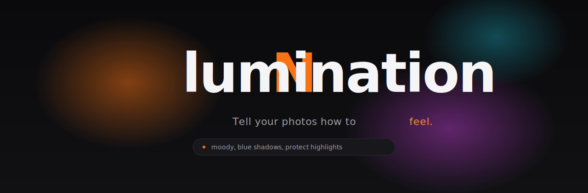

<div align="center">

<a href="https://nlumination.vercel.app/">
  
</a>

<br/>

<p>
  <strong>Natural-language color grading. In your browser. At full resolution.</strong>
  <br/>
  <em>Type a feeling. Get a Lightroom-grade edit.</em>
</p>

<p>
  <a href="https://nlumination.vercel.app/">
    
  </a>
</p>

</div>

<br/>

## Talk to your photos.

Color grading used to mean twelve sliders, three curve panels, and a lot of guesswork. Now you write:

```
moody, blue shadows, protect highlights, push the blues toward teal
```

NLumination parses that, decides which adjustments to move and by how much, and renders the result on a WebGL2 pipeline at native resolution — on your device. No upload. No LLM call. No waiting.

Then if you want to fine-tune, the sliders are right there.

<br/>

## Why it's different

<table>
<tr>
<td width="33%" valign="top">

### Compositional
Phrases compose. *"Slightly warmer, less contrast in the shadows, push the blues toward teal"* moves four sliders in the right directions — not one.

</td>
<td width="33%" valign="top">

### Local-first
Your pixels never leave your machine. Decoding, grading, preview — all client-side via WebGL2. Only a final JPEG you choose to save ever touches the network.

</td>
<td width="33%" valign="top">

### Reversible
Edits are stored as parameter deltas, not flattened pixels. Re-open any saved edit. Keep grading. Undo a year later. Same result.

</td>
</tr>
</table>

<br/>

## Examples

| Prompt | What moves |
|---|---|
| `cinematic teal & orange` | Split-tone shadows → teal, highlights → orange; subtle contrast bump |
| `golden hour, soft` | WB warmer · clarity down · lift shadows · gentle S-curve |
| `crush the blacks, keep skin warm` | Black point down · HSL orange luminance preserved |
| `desaturate everything except the red dress` | Global saturation down · HSL red saturation up |
| `vintage film, faded blacks, warm` | Tone-curve lift · WB warm · slight magenta in shadows |

<br/>

## How it works

```
┌─────────────┐     ┌──────────────┐     ┌──────────────┐     ┌──────────────┐
│  Your text  │ ──▶ │  NL parser   │ ──▶ │  Param delta │ ──▶ │ WebGL2 grade │
└─────────────┘     │ (no LLM)     │     │ (JSON)       │     │ (native res) │
                    └──────────────┘     └──────────────┘     └──────────────┘
```

1. **Parse.** A compositional intent parser walks the sentence, matches against a catalog of moods, modifiers, and color targets, and emits structured deltas. Pure TS, runs in &lt; 1 ms.
2. **Compose.** Deltas merge into a single `GradingParams` snapshot. The UI sliders reflect this snapshot, so anything the prompt did is editable by hand.
3. **Render.** A two-pass WebGL2 pipeline applies WB → exposure → tone → HSL → curves → split-tone → vignette → optional 3D LUT, then letterboxes to canvas.
4. **Save.** Saved edits are stored as parameter snapshots in Postgres. The JPEG export is generated on-demand from the same pipeline.

<br/>

## Quickstart

```bash
git clone https://github.com/jiajunl23/nlumination.git
cd nlumination
pnpm install
cp .env.local.example .env.local   # add your keys
pnpm db:push                        # apply schema to Neon
pnpm dev
```

Open <http://localhost:3000>. Without env keys, Clerk runs in keyless dev mode — saving to the gallery requires real credentials.

<br/>

## Stack

| Layer | Choice | Why |
|---|---|---|
| Framework | **Next.js 16** (App Router) · **React 19** · **TypeScript** | Server components for auth-gated pages, RSC-friendly data fetching |
| Styling | **Tailwind v4** | Token-driven theme, `@theme inline` for design system |
| Auth | **Clerk** | Drop-in, keyless dev mode, `<Show>` primitives |
| Database | **Neon** + **Drizzle ORM** | Serverless Postgres, branchable, type-safe queries |
| Storage | **Cloudinary** | Free 25 GB, on-the-fly transforms, no card required |
| Pixels | **WebGL2** + custom GLSL | Native-res, GPU-accelerated, fully local |
| Prompts | In-house parser | Deterministic, &lt; 1 ms, no API call |

<br/>

## Service setup

<details>
<summary><strong>Clerk</strong> &nbsp;— auth, optional in dev</summary>
<br/>

1. Create an app at <https://dashboard.clerk.com>.
2. Copy the publishable + secret keys into `.env.local`.
3. *(Optional)* Add a webhook on `user.created` pointing to `/api/webhooks/clerk` for eager DB user creation. The app falls back to lazy creation if the webhook hasn't fired.

</details>

<details>
<summary><strong>Neon</strong> &nbsp;— Postgres, required for the gallery</summary>
<br/>

1. Create a project at <https://console.neon.tech>.
2. Copy the **pooled** connection string (with `?sslmode=require`) into `DATABASE_URL`.
3. Run `pnpm db:push` to create `users`, `photos`, `edits`.

</details>

<details>
<summary><strong>Cloudinary</strong> &nbsp;— image CDN, free tier no card</summary>
<br/>

1. Create a free account at <https://cloudinary.com>.
2. From the Dashboard, copy **Cloud name**, **API Key**, and **API Secret** into `CLOUDINARY_CLOUD_NAME`, `CLOUDINARY_API_KEY`, `CLOUDINARY_API_SECRET`. Set `NEXT_PUBLIC_CLOUDINARY_CLOUD_NAME` to the same cloud name.
3. No CORS or bucket setup. Free tier: 25 GB storage, 25 GB monthly bandwidth, 25k transformations. When you hit a limit, Cloudinary stops serving — no surprise bills.

</details>

<br/>

## Scripts

| Command | What it does |
|---|---|
| `pnpm dev` | Local dev server (Turbopack) |
| `pnpm build` · `pnpm start` | Production build / start |
| `pnpm db:generate` | Drizzle: generate a migration from the schema diff |
| `pnpm db:push` | Drizzle: push current schema to the configured DB |
| `pnpm db:studio` | Open Drizzle Studio |
| `pnpm test:parser` | Smoke-test the NL parser with built-in cases |

<br/>

## Keyboard shortcuts

| Key | Action |
|---|---|
| <kbd>B</kbd> *(hold)* | View original — release to return to graded |
| <kbd>⌘</kbd> + <kbd>S</kbd> | Save edit to gallery |
| <kbd>⌘</kbd> + <kbd>E</kbd> | Export current grade as JPG |

<br/>

## Deploy

<a href="https://vercel.com/new/clone?repository-url=https%3A%2F%2Fgithub.com%2Fjiajunl23%2Fnlumination">
  
</a>

Set the same env vars in project settings and connect the repo. The Clerk middleware (`proxy.ts`) ships automatically.

<br/>

---

<div align="center">

**Built for photographers who'd rather describe a feeling than chase a slider.**

<sub>NLumination is a love letter to color, written in TypeScript and shaders.</sub>

</div>
